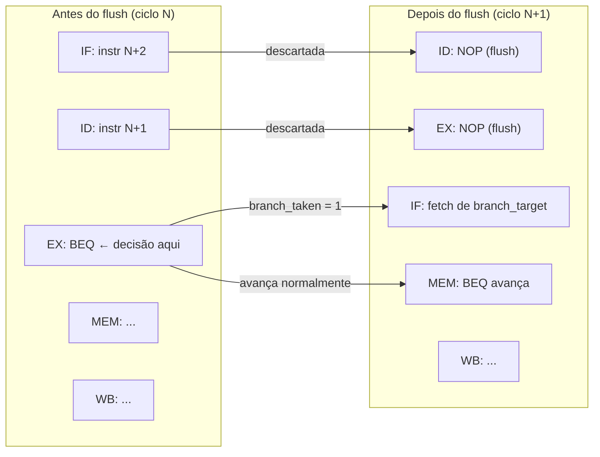

# Relatório Técnico: Implementação de Processador RISC-V com Pipeline

João Costa Calazans

## Introdução

Os processadores baseados na arquitetura RISC-V têm ganhado enorme destaque acadêmico e na indústria por sua natureza de código aberto e simplicidade (Reduced Instruction Set Computer). Uma das técnicas fundamentais para aumentar o desempenho desses processadores é o **pipeline**. Ao dividir a execução das instruções em múltiplos estágios (como Busca, Decodificação, Execução, Memória e Escrita), o pipeline permite que várias instruções sejam processadas simultaneamente, aumentando o *throughput* (vazão) do processador. No entanto, essa sobreposição de instruções introduz desafios conhecidos como *hazards* (conflitos de dados e de controle), que requerem lógicas adicionais para resolução, como mecanismos de encaminhamento (*forwarding*) e detecção de riscos com inserção de bolhas (*stalls*).

## Descrição do Desenvolvimento

### Parte 1: Branch e Controle de Fluxo (João C.)

A primeira etapa do trabalho consistiu na implementação da Unidade de Desvio (`BranchUnit.v`), responsável por tratar as instruções de desvio condicional, especificamente o `BEQ` (Branch if Equal).

#### Lógica da Instrução BEQ e Cálculo de Destino
A lógica implementada no estágio de Execução (EX) verifica se o `opcode` da instrução corresponde ao `BEQ` (7'b110_0011) e se os valores dos registradores fonte (`rs1_value` e `rs2_value`) são rigorosamente iguais. Quando essa condição é satisfeita, o sinal `branch_taken` é ativado (`1'b1`). 

O endereço de destino do desvio (`branch_target`) é calculado somando-se o PC do estágio de Execução (`pc_ex`) ao valor imediato fornecido na própria instrução. O imediato já é tratado com a devida extensão de sinal e alinhamento de 2 bytes (bit menos significativo igual a 0).

#### Lógica de Flush
A decisão sobre o sucesso ou falha de um desvio ocorre apenas no estágio EX. Portanto, as instruções que entram sequencialmente no pipeline após um branch já foram carregadas e estão nos estágios de Busca (IF) e Decodificação (ID). 

Quando o desvio é efetivado (sinal `branch_taken == 1` no estágio EX), ele imediatamente aciona a operação de *flush*. Isso causa o descarte de 2 instruções, substituindo os conteúdos dos registradores de estágio `IF/ID` e `ID/EX` por NOPs. Esse mecanismo garante que instruções erradas do fluxo não alterem o estado da CPU. O PC é atualizado para o endereço de `branch_target`, e a instrução de BEQ original continua seu fluxo para o estágio MEM/WB normalmente.

### Parte 2: Código Assembly (Integrante 2)
*(Placeholder: Descrever as modificações realizadas na task `load_program_full_dependencies`, detalhando a inserção manual de NOPs e reordenação de código assembly para testar a mitigação de hazards.)*

### Parte 3a: Forwarding (Integrante 3)
*(Placeholder: Descrever o desenvolvimento do módulo `ForwardingUnit.v` para os estágios MEM e WB, explicando como o bypass (encaminhamento de dados) evita stalls causados por hazards de dependência de dados RAW.)*

### Parte 3b: Hazard Detection (Integrante 4)
*(Placeholder: Descrever o desenvolvimento do módulo `HazardDetectionUnit.v` responsável por identificar hazards do tipo load-use, gerando bolhas (stalls) de forma dinâmica no pipeline quando dados de memória são imediatamente necessários na ALU.)*

## Resultados Obtidos

A validação inicial do sistema com a `BranchUnit.v` e mecanismo de descarte confirmou o sucesso da **Parte 1**. Na simulação do conjunto de testes:
- O módulo efetuou o **desvio** corretamente com base no sucesso da comparação de operandos, resultando em 1 Branch sinalizado e 1 Flush executado.
- A eficiência do *flush* pôde ser constatada uma vez que o registrador `x5` se manteve no valor `0`. A instrução imediatamente seguinte ao BEQ tentaria salvar "99" no `x5`, confirmando que ela foi interceptada nos registradores iniciais e substituída por um NOP.

Por outro lado, foram registrados erros lógicos em valores computados nos registradores `x2`, `x3`, `x4` e `x7`. Tais erros são o comportamento **esperado** da nossa CPU nesse primeiro cenário, uma vez que as lógicas das próximas etapas (*ForwardingUnit* e *HazardDetectionUnit*) encontram-se temporariamente ausentes, inviabilizando o tratamento das pesadas dependências de dados presentes nas instruções sequenciais.

## Conclusão
*(Placeholder: Síntese do grupo após a finalização de todos os módulos. Analisar o impacto da introdução completa dos tratamentos de hazards e do forwarding nas taxas de CPI (Cycles Per Instruction) e no desempenho da máquina comparado ao uso exclusivo de stalls e flushes.)*

## Declaração de Uso de IA

Atendendo aos requisitos éticos da disciplina, declaramos a utilização de modelos generativos de IA para apoio técnico.

### **Prompt Utilizado na Parte 1**

**Atue como um especialista em Arquitetura de Computadores e Verilog.**

**1. Definição do Problema:**

Preciso implementar o módulo `BranchUnit.v` para um processador RISC-V com pipeline de 5 estágios. O objetivo é garantir que o processador trate corretamente instruções de desvio condicional, calculando o destino e limpando as instruções incorretas que entraram no pipeline.

**2. Contexto do Projeto e Equipe:**

Este trabalho é realizado em grupo, e a minha responsabilidade é a primeira etapa do fluxo. Abaixo está a divisão de tarefas para contextualizar a precedência das lógicas:

| **Ordem** | **Responsável**  | **Subtarefa**                     | **Descrição Técnica**                                        |
| --------- | ---------------- | --------------------------------- | ------------------------------------------------------------ |
| **1**     | **João C.**      | **Parte 1: Branch e Fluxo**       | Implementar o módulo `BranchUnit.v`. Inclui a lógica da instrução $BEQ$, o cálculo do endereço de destino e o flush de instruções no pipeline. |
| **2**     | **Integrante 2** | **Parte 2: Código Assembly**      | Modificar a task `load_program_full_dependencies` inserindo NOPs e reordenando instruções. |
| **3**     | **Integrante 3** | **Parte 3a: Forwarding**          | Implementar o módulo `ForwardingUnit.v` para os estágios MEM e WB. |
| **4**     | **Integrante 4** | **Parte 3b: Hazard Detection**    | Implementar o módulo `HazardDetectionUnit.v` para conflitos *load-use*. |
| **5**     | **Integrante 5** | **Parte 4: Métricas e Relatório** | Coletar dados de CPI, ciclos e stalls do `PipelineStats.v` e redigir o relatório final. |

**3. Requisitos Funcionais (Especificação):**

- **Instrução BEQ:** Implementar a comparação de igualdade entre os operandos vindos dos registradores. 
- **Estágio EX:** A comparação e a decisão de desvio devem ser realizadas obrigatoriamente no estágio de Execução (EX). 
- **Cálculo de Destino:** Calcular o endereço de destino somando o PC atual ao imediato (offset) fornecido. 
- **Controle de PC:** Gerar o sinal para que o PC seja atualizado com o endereço de destino caso a condição seja verdadeira. 
- **Lógica de Flush:** Gerar um sinal de `flush` que descarte as instruções carregadas incorretamente nos estágios iniciais (IF/ID) quando um branch é tomado. 

**4. Restrições e Requisitos Não-Funcionais:**

- **Modelo de Referência:** Seguir a arquitetura apresentada na Figura e4.14.3 do livro *Computer Organization and Design RISC-V Edition* (Patterson & Hennessy). 
- **Linguagem:** Verilog didático (não sintetizável). 
- **Interface:** Respeitar rigorosamente os nomes de portas e sinais definidos no arquivo de esqueleto `src/BranchUnit.v`.
- **Arquivos de Referência:** Utilize as definições contidas no `README.md` e no PDF do "Trabalho Prático 2" para garantir a compatibilidade com o testbench fornecido.

**Tarefa:** Com base nestas especificações, gere o código Verilog para o módulo `BranchUnit.v` e explique brevemente como a sinalização de `flush` deve interagir com os registradores de estágio (IF/ID e ID/EX).

### **Prompt Utilizado na Parte 2**

### **Prompt Utilizado na Parte 3a**

### **Prompt Utilizado na Parte 3b**

### **Prompt Utilizado na Parte 4**
