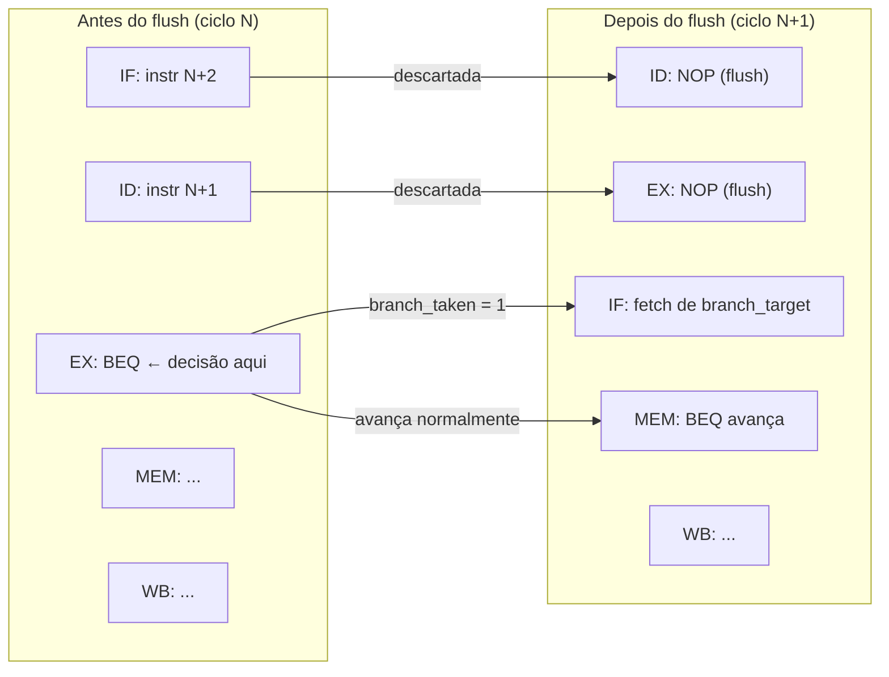
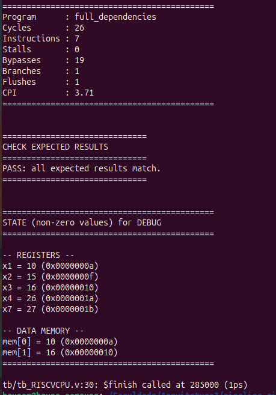
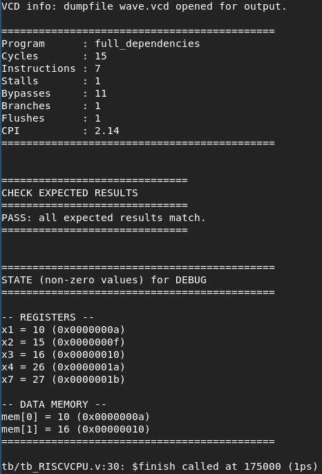

# Relatório Técnico: Implementação de Processador RISC-V com Pipeline

João Costa Calazans

## Introdução

Os processadores baseados na arquitetura RISC-V têm ganhado enorme destaque acadêmico e na indústria por sua natureza de código aberto e simplicidade (Reduced Instruction Set Computer). Uma das técnicas fundamentais para aumentar o desempenho desses processadores é o **pipeline**. Ao dividir a execução das instruções em múltiplos estágios (como Busca, Decodificação, Execução, Memória e Escrita), o pipeline permite que várias instruções sejam processadas simultaneamente, aumentando o *throughput* (vazão) do processador. No entanto, essa sobreposição de instruções introduz desafios conhecidos como *hazards* (conflitos de dados e de controle), que requerem lógicas adicionais para resolução, como mecanismos de encaminhamento (*forwarding*) e detecção de riscos com inserção de bolhas (*stalls*).

## Descrição do Desenvolvimento

### Parte 1: Branch e Controle de Fluxo (João C.)

A primeira etapa do trabalho consistiu na implementação da Unidade de Desvio (`BranchUnit.v`), responsável por tratar as instruções de desvio condicional, especificamente o `BEQ` (Branch if Equal).

#### Lógica da Instrução BEQ e Cálculo de Destino
A lógica implementada no estágio de Execução (EX) verifica se o `opcode` da instrução corresponde ao `BEQ` (7'b110_0011) e se os valores dos registradores fonte (`rs1_value` e `rs2_value`) são rigorosamente iguais. Quando essa condição é satisfeita, o sinal `branch_taken` é ativado (`1'b1`). 

O endereço de destino do desvio (`branch_target`) é calculado somando-se o PC do estágio de Execução (`pc_ex`) ao valor imediato fornecido na própria instrução. O imediato já é tratado com a devida extensão de sinal e alinhamento de 2 bytes (bit menos significativo igual a 0).

#### Lógica de Flush
A decisão sobre o sucesso ou falha de um desvio ocorre apenas no estágio EX. Portanto, as instruções que entram sequencialmente no pipeline após um branch já foram carregadas e estão nos estágios de Busca (IF) e Decodificação (ID). 

Quando o desvio é efetivado (sinal `branch_taken == 1` no estágio EX), ele imediatamente aciona a operação de *flush*. Isso causa o descarte de 2 instruções, substituindo os conteúdos dos registradores de estágio `IF/ID` e `ID/EX` por NOPs. Esse mecanismo garante que instruções erradas do fluxo não alterem o estado da CPU. O PC é atualizado para o endereço de `branch_target`, e a instrução de BEQ original continua seu fluxo para o estágio MEM/WB normalmente.



### Parte 2: Código Assembly (João Pedro)
A task load_program_full_dependencies recebeu modificações para permitir o funcionamento correto de um pipeline. A simulação necessitou da implementação manual de Bolhas ou NOPS entre instruções com interdependência de dados, o que apenas atrasa a execução. Esse atraso é essencial para simular um pipeline real, já que o grande problema das dependências é garantir a confiabilidade do dado lido. Para fazer isso a técnicas de NOP funciona magistralmente, pois ao atrasar a próxima instrução se garante que o dado será escrito no registrador para ser usado pela proxima instrução.
O código original continha varios problemas de dependências, já na primeira linha o load word (lw) do X1 é seguido por um ADDi X2, X1, 5. Essa estrutura tende a gerar uma leitura errada, devido aos estágios em que se encontram. lw só registra o dado no estágio de Acesso a Memória(MEM) e Escrita mas ADDi necessita do mesmo em Execução (EX).
Logo, a solução foi a implementação das bolhas, que nessa situação foram 3, para garantir que X1 esteja escrito quando ele for requisitado na soma. Outro detalhe que a modificação requer é a alteração do offset do BEQ, ja que com a inserção de mais operações, que aumentam o número total e ocupam espaço na pilha, o endereço do mesmo será alterado e precisou ser recalculado.

### Parte 3a: Forwarding (Lucas Carneiro)
O modulo ForwardingUnit.v foi desenvolvido para resolver hazards do tipo RAW sem a necessidade de interromper o pipeline, reduzindo os stalls. O código original continha apenas os sinais de entrada e saída declarados, sem implementação, com as saídas forwardA e forwardB a ser sempre NO_FORWARD.
A implementação feita detecta dois casos de bypass para os operadores. O primeiro é o forwarding do estágio MEM, ativado quando a instrução em Execução ou Acesso a Memória (EX/MEM) é uma operação ALU (ALUop), seu registrador destino não é x0 e coincide com rs1 ou rs2 da instrução atual em Decodificação e Execução (ID/EX), nesse caso forwardA ou forwardB recebe FROM_MEM. O segundo é o forwarding do estágio de WB, ativado quando a instrução em MEM/WB é uma operação ALU ou um lw, com condições análogas, resultando em FROM_WB_ALU ou FROM_WB_LD respectivamente. A prioridade do forwarding de MEM sobre WB é garantida pela estrutura if/else if, evitando conflito quando ambos os estágios possuem o mesmo registrador destino.

### Parte 3b: Hazard Detection (Pedro Debs)
O código do HazardDetectionUnit.v foi alterado para identificar corretamente casos de hazards load-use, ou seja, quando tem-se uma instrução que utiliza de um valor logo em sequência da instrução de leitura do mesmo. Isto ocorre devido ao estágio, pois como o dado ao ser lido so está disponivel após o estágio de WB, enquanto a próxima utiliza no inicio da EX. Assim, não  há bypass que consiga realizar a entrega do dado a tempo, gerando um stall.
A lógica implementada verifica se a instrução no estágio EX ou MEM é um LW e, em caso positivo, checa se a instrução atualmente em ID ou EX é uma ALUop que utiliza rs1 ou rs2 coincidentes com o registrador destino do load, uma  Store Word (SW) que utiliza esse registrador como base de endereço, ou um BEQ que depende do valor em qualquer um dos seus dois operandos. Quando qualquer uma dessas condições é satisfeita, o sinal de stall é ativado, parando os estágios Fetch ou Decodificação (IF ouID) e Decodificação ou Execução (ID ou EX) ao inserir um NOP no estágio EX ouMEM pelo ciclo necessário para que o dado esteja disponível via forwarding no ciclo seguinte.
 
## Resultados Obtidos (Bruno Menezes)

A validação inicial do sistema com a `BranchUnit.v` e mecanismo de descarte confirmou o sucesso da **Parte 1**. Na simulação do conjunto de testes:
- O módulo efetuou o **desvio** corretamente com base no sucesso da comparação de operandos, resultando em 1 Branch sinalizado e 1 Flush executado.
- A eficiência do *flush* pôde ser constatada uma vez que o registrador `x5` se manteve no valor `0`. A instrução imediatamente seguinte ao BEQ tentaria salvar "99" no `x5`, confirmando que ela foi interceptada nos registradores iniciais e substituída por um NOP.

Por outro lado, foram registrados erros lógicos em valores computados nos registradores `x2`, `x3`, `x4` e `x7`. Tais erros são o comportamento **esperado** da nossa CPU nesse primeiro cenário, uma vez que as lógicas das próximas etapas (*ForwardingUnit* e *HazardDetectionUnit*) encontram-se temporariamente ausentes, inviabilizando o tratamento das pesadas dependências de dados presentes nas instruções sequenciais.

No que diz respeito às métricas de avaliação, foram realizados testes para validar o comportamento esperado e obter informações sobre o funcionamento do pipeline. Na abordagem com inserção de bolhas (NOPs), utiliza-se uma operação ADDI que soma zero a zero, servindo apenas para expandir os ciclos de execução e garantir que um registrador seja escrito antes de ser lido por uma instrução subsequente. Essa abordagem é interessante para este momento inicial, pois permite visualizar parâmetros do pipeline sob a hipótese de que a técnica garante o funcionamento correto ao custo de desempenho inferior em relação a uma implementação com forwarding.

Assim, foi encontrado os seguintes resultados ao simular utilizando as bolhas: 


Os resultados obtidos na simulação com NOPs foram os seguintes: CPI de 3,71, zero stalls, zero bypasses e 26 ciclos totais. Esses valores são esperados: o número de instruções aumenta consideravelmente em relação ao programa original devido aos NOPs inseridos, e a ausência de stalls é consequência direta dessa abordagem. Um stall ocorre quando uma instrução necessita de um valor em um registrador que ainda não foi escrito por uma operação anterior, ao inserir bolhas manualmente, essa situação é evitada de forma conservadora, eliminando conflitos ao custo de reduzir o paralelismo do pipeline.

Analisando agora a implementação do fowarding, que é uma implementação que busca evitar stalls, em que ao inves de esperar que o dado seja escrito para que a proxima operação seja executada, se encaminha o dado após a execução de uma operação para a proxima antes de gravar o mesmo. Isso se faz fisicamente ao implementar multiplexadores com uma saida a mais que conecta o fim do estado EX da primeira execução com o inicio do estagio EX da proxima, garantindo que o dado que ia ser gravado estará correto, mas sem precisar de parar a execução devido ao tempo de espera do estagio de escrita. Nos casos em que o forwarding não é suficiente, especificamente no hazard do tipo load-use, em que o dado só está disponível após o estágio MEM, a unidade de detecção de hazards insere um stall automaticamente.

Ao implementar tanto o fowarding quanto o o hazarding detection, eliminando o uso dos nops, se obteve os seguintes resultados:



Com a implementação do forwarding e da detecção de hazards, eliminando o uso dos NOPs, obtiveram-se os seguintes resultados: CPI de 2,14, 15 ciclos, 1 stall e bypasses ativos. A melhora em relação à abordagem anterior é expressiva: o CPI caiu de 3,71 para 2,14 e o número de ciclos reduziu de 26 para 15. O único stall registrado ocorreu no caso inevitável de dependência load-use, demonstrando que a lógica implementada insere stalls somente quando estritamente necessário. Quanto ao impacto do branch no desempenho, a resolução do desvio condicional ocorre no estágio EX, o que exige o flush das instruções já carregadas no pipeline quando o desvio é tomado. Esse mecanismo introduz uma penalidade de ciclos, aumentando o CPI e evidenciando a necessidade de técnicas como predição de desvios para mitigar esse impacto em programas com muitos desvios condicionais.

Em termos da branch, ela impacta negativamente o desempenho do pipeline devido à necessidade da resolução da mesma no estágio de execução. Quando se faz o desvio, instruções buscadas anteriormente são inpossibilitadas de continuar, exigindo o flush do pipeline. Esse mecanismo gera penalidades ao sistema, aumentando o número de ciclos e o CPI. Assim, branches reduzem a eficiência do pipeline ao interromper a sequencia de instruções, evidenciando a necessidade de abordagens como predição de desvios para mitigação desse impacto.

## Conclusão
O desenvolvimento deste trabalho permitiu compreender, de forma prática, os principais desafios envolvidos na implementação de um processador com pipeline, especialmente no tratamento de hazards de dados e de controle em uma arquitetura RISC-V. A divisão incremental das etapas foi fundamental para evidenciar como cada mecanismo adicionado ao pipeline impacta diretamente no desempenho do processador.

Na primeira etapa, referente ao tratamento de branches, observou-se que desvios condicionais introduzem penalidades ao pipeline. Como a decisão do branch ocorre no estágio EX, instruções previamente carregadas tornam-se inválidas quando o desvio é tomado, exigindo o flush do pipeline e a inserção de NOPs. Esse comportamento reduz a eficiência da execução sobreposta, aumentando o número de ciclos e o CPI, e demonstra a importância de técnicas como predição de desvios para minimizar o impacto dos hazards de controle.

Na segunda etapa, com reordenação de instruções e inserção manual de bolhas, foi possível garantir a execução correta do programa sem mecanismos automáticos de detecção de dependências. Entretanto, essa abordagem apresentou custo elevado em desempenho: a inserção de NOPs aumentou o número total de instruções e ciclos executados, resultando em CPI de 3,71. A ausência de stalls confirma que as bolhas atuam como solução conservadora para evitar conflitos de dependência, porém ao custo direto de reduzir o paralelismo e a eficiência do pipeline.

Na terceira etapa, a implementação das unidades de Hazard Detection e Forwarding permitiu uma abordagem mais eficiente e próxima de arquiteturas reais. O forwarding possibilitou encaminhar dados diretamente entre estágios do pipeline sem aguardar a escrita no banco de registradores, reduzindo a necessidade de interrupções na execução. Como resultado, houve melhora expressiva nas métricas: o CPI reduziu de 3,71 para 2,14 e o número de ciclos caiu de 26 para 15. O único stall registrado ocorreu no caso de dependência load-use, que é estruturalmente inevitável mesmo com forwarding ativo, confirmando que a lógica implementada opera corretamente.

Dessa forma, os resultados obtidos validam o funcionamento correto dos mecanismos implementados e evidenciam a importância do forwarding e da detecção de hazards para aumentar a eficiência de arquiteturas pipelineadas. Comparando as abordagens, conclui-se que o uso exclusivo de stalls, flushes e NOPs garante corretude, porém compromete fortemente o desempenho, enquanto a introdução de forwarding reduz penalidades e melhora significativamente o aproveitamento do pipeline. Assim, o trabalho demonstrou na prática como técnicas de tratamento de hazards são fundamentais para aproximar o comportamento do processador de implementações modernas de alto desempenho.

## Declaração de Uso de IA

Atendendo aos requisitos éticos da disciplina, declaramos a utilização de modelos generativos de IA para apoio técnico.

### **Prompt Utilizado na Parte 1**

**Atue como um especialista em Arquitetura de Computadores e Verilog.**

**1. Definição do Problema:**

Preciso implementar o módulo `BranchUnit.v` para um processador RISC-V com pipeline de 5 estágios. O objetivo é garantir que o processador trate corretamente instruções de desvio condicional, calculando o destino e limpando as instruções incorretas que entraram no pipeline.

**2. Contexto do Projeto e Equipe:**

Este trabalho é realizado em grupo, e a minha responsabilidade é a primeira etapa do fluxo. Abaixo está a divisão de tarefas para contextualizar a precedência das lógicas:

| **Ordem** | **Responsável**  | **Subtarefa**                     | **Descrição Técnica**                                        |
| --------- | ---------------- | --------------------------------- | ------------------------------------------------------------ |
| **1**     | **João C.**      | **Parte 1: Branch e Fluxo**       | Implementar o módulo `BranchUnit.v`. Inclui a lógica da instrução $BEQ$, o cálculo do endereço de destino e o flush de instruções no pipeline. |
| **2**     | **Integrante 2** | **Parte 2: Código Assembly**      | Modificar a task `load_program_full_dependencies` inserindo NOPs e reordenando instruções. |
| **3**     | **Integrante 3** | **Parte 3a: Forwarding**          | Implementar o módulo `ForwardingUnit.v` para os estágios MEM e WB. |
| **4**     | **Integrante 4** | **Parte 3b: Hazard Detection**    | Implementar o módulo `HazardDetectionUnit.v` para conflitos *load-use*. |
| **5**     | **Integrante 5** | **Parte 4: Métricas e Relatório** | Coletar dados de CPI, ciclos e stalls do `PipelineStats.v` e redigir o relatório final. |

**3. Requisitos Funcionais (Especificação):**

- **Instrução BEQ:** Implementar a comparação de igualdade entre os operandos vindos dos registradores. 
- **Estágio EX:** A comparação e a decisão de desvio devem ser realizadas obrigatoriamente no estágio de Execução (EX). 
- **Cálculo de Destino:** Calcular o endereço de destino somando o PC atual ao imediato (offset) fornecido. 
- **Controle de PC:** Gerar o sinal para que o PC seja atualizado com o endereço de destino caso a condição seja verdadeira. 
- **Lógica de Flush:** Gerar um sinal de `flush` que descarte as instruções carregadas incorretamente nos estágios iniciais (IF/ID) quando um branch é tomado. 

**4. Restrições e Requisitos Não-Funcionais:**

- **Modelo de Referência:** Seguir a arquitetura apresentada na Figura e4.14.3 do livro *Computer Organization and Design RISC-V Edition* (Patterson & Hennessy). 
- **Linguagem:** Verilog didático (não sintetizável). 
- **Interface:** Respeitar rigorosamente os nomes de portas e sinais definidos no arquivo de esqueleto `src/BranchUnit.v`.
- **Arquivos de Referência:** Utilize as definições contidas no `README.md` e no PDF do "Trabalho Prático 2" para garantir a compatibilidade com o testbench fornecido.

**Tarefa:** Com base nestas especificações, gere o código Verilog para o módulo `BranchUnit.v` e explique brevemente como a sinalização de `flush` deve interagir com os registradores de estágio (IF/ID e ID/EX).

### **Prompt Utilizado na Parte 2**

### **Prompt Utilizado na Parte 3a**

### **Prompt Utilizado na Parte 3b**

### **Prompt Utilizado na Parte 4**
Atue como um Engenheiro de Hardware especialista em RISC-V. Tenho uma implementação de pipeline de 5 estágios em Verilog dividida entre as pastas src e tb.
Objetivo: Automatizar a extração de métricas (CPI, Stalls, Flushes) para o relatório acadêmico.Estrutura:

src/: Contém RISCVCPU.v, BranchUnit.v, ForwardingUnit.v, HazardDetectionUnit.v e PipelineStats.v.
tb/: Contém tb_RISCVCPU.v.
Tarefas:

Analise o PipelineStats.v e sugira como conectá-lo aos sinais de controle do pipeline (stall, flush, branch_taken) em tb_RISCVCPU.v.
Gere um guia que compile os fontes e o testbench, execute a simulação e gere um arquivo de log formatado com os contadores de ciclo.
Como calcular matematicamente o CPI final baseando-se no número total de ciclos (cycle_count) e no número de instruções commitadas (instr_count)? module PipelineStats (
    input clock,
    input reset,

    input instr_commit,
    input stall,
    input bypassA_MEM,
    input bypassB_MEM,
    input bypassA_WB,
    input bypassB_WB,
    input branch_taken,
    input flush,

    output reg [31:0] cycle_count,
    output reg [31:0] instr_count,
    output reg [31:0] stall_count,
    output reg [31:0] bypass_count,
    output reg [31:0] branch_taken_count,
    output reg [31:0] flush_count
);

    always @(posedge clock) begin
        if (reset) begin
            cycle_count        <= 32'd0;
            instr_count        <= 32'd0;
            stall_count        <= 32'd0;
            bypass_count       <= 32'd0;
            branch_taken_count <= 32'd0;
            flush_count        <= 32'd0;
        end
        else begin
                      cycle_count <= cycle_count + 32'd1;

            if (instr_commit) begin
                instr_count <= instr_count + 32'd1;
            end

            if (stall) begin
                stall_count <= stall_count + 32'd1;
            end

            if (bypassA_MEM || bypassB_MEM || bypassA_WB || bypassB_WB) begin
                bypass_count <= bypass_count + 32'd1;
            end

            if (branch_taken) begin
                branch_taken_count <= branch_taken_count + 32'd1;
            end

            if (flush) begin
                flush_count <= flush_count + 32'd1;
            end
        end
    end

endmodule 
Ai tem 2 arquivos da pasta src o pipeline stats e o RISCVCPU.v e o da pasta tb.

Entendido! Vou criar um guia prático de compilação, execução e análise de métricas com Icarus Verilog.Agora vou criar o guia completo:
1. Estrutura de diretórios esperada
projeto/
├── src/
│   ├── RISCVCPU.v
│   ├── PipelineStats.v
│   ├── ForwardingUnit.v
│   ├── HazardDetectionUnit.v
│   └── BranchUnit.v
├── tb/
│   └── tb_RISCVCPU.v
├── sim/          ← gerado automaticamente
└── Makefile

2. Makefile completo
makefile# Makefile — RISC-V Pipeline
IVERILOG = iverilog
VVP      = vvp
SRCS     = src/PipelineStats.v src/ForwardingUnit.v src/HazardDetectionUnit.v \
           src/BranchUnit.v src/RISCVCPU.v
TB       = tb/tb_RISCVCPU.v
OUT      = sim/sim.out
LOG      = sim/results.log

all: run

$(OUT): $(SRCS) $(TB)
	mkdir -p sim
	$(IVERILOG) -g2012 -o $(OUT) $(SRCS) $(TB)

run: $(OUT)
	$(VVP) $(OUT) | tee $(LOG)

wave: $(OUT)
	$(VVP) $(OUT)
	gtkwave sim/wave.vcd &

clean:
	rm -rf sim/
Comandos do dia a dia:
bashmake          # compila + simula + salva log em sim/results.log
make wave     # abre GTKWave com o .vcd gerado
make clean    # limpa tudo para recompilar do zero

3. Compilar e simular manualmente (sem Makefile)
bash# Compilar todos os fontes + testbench de uma vez
iverilog -g2012 -o sim/sim.out \
  src/PipelineStats.v \
  src/ForwardingUnit.v \
  src/HazardDetectionUnit.v \
  src/BranchUnit.v \
  src/RISCVCPU.v \
  tb/tb_RISCVCPU.v

# Executar e salvar log
vvp sim/sim.out | tee sim/results.log

# Ver o log depois
cat sim/results.log
A flag -g2012 garante suporte a SystemVerilog 2012 — importante para $itor() e tarefas automáticas que você usa no testbench.

4. O que o print_stats imprime e como ler
O log vai mostrar algo assim:
============================================
Program      : full_dependencies
Cycles       : 23
Instructions : 7
Stalls       : 2
Bypasses     : 4
Branches     : 1
Flushes      : 1
CPI          : 3.29
============================================
CampoO que contacycle_countTodo posedge clock após o resetinstr_countInstruções que passaram pelo estágio WB (instr_commit)stall_countCiclos em que stall == 1 (load-use hazard)bypass_countCiclos com qualquer forward ativo (MEM→EX ou WB→EX)branch_taken_countDesvios efetivamente tomadosflush_countFlushes do pipeline (= branch_taken no seu design)

5. Cálculo matemático do CPI
CPI = cycle_count / instr_count
Decomposição analítica — permite prever o CPI antes de simular:
CPI = 1  +  (stall_count / instr_count)  +  (flush_count × 2 / instr_count)
       ↑              ↑                              ↑
   ideal          load-use                    branch penalty
               (1 ciclo cada)              (2 instruções flushadas)
Se CPI > 1.0 o motivo estará em stall_count ou flush_count. Use isso para validar o valor calculado pelo $itor do testbench.

6. Workflow de comparação entre experimentos
A abordagem mais prática é renomear o log a cada variante:
bash# Baseline (com forwarding + hazard detection)
make run
cp sim/results.log sim/log_baseline.txt

# Variante: desabilitar forwarding (edite ForwardingUnit.v para sempre retornar NO_FORWARD)
make clean && make run
cp sim/results.log sim/log_sem_forwarding.txt

# Diff rápido
diff sim/log_baseline.txt sim/log_sem_forwarding.txt
Para comparar vários experimentos de uma vez:
bashgrep -E "CPI|Stalls|Bypasses|Flushes" sim/log_*.txt
Saída exemplo:
log_baseline.txt:        Stalls  : 2
log_baseline.txt:        Bypasses: 4
log_baseline.txt:        CPI     : 3.29
log_sem_forwarding.txt:  Stalls  : 6
log_sem_forwarding.txt:  Bypasses: 0
log_sem_forwarding.txt:  CPI     : 4.57

7. Checklist de conexão do PipelineStats
O RISCVCPU.v que você forneceu já instancia PipelineStats corretamente — os sinais estão todos conectados via assign e a instanciação está no corpo do módulo. O que o testbench acessa via cpu.stats.cycle_count etc. já funciona. Só confirme que:

PipelineStats.v está na lista de fontes passada ao iverilog — ele não é incluído via include, precisa estar explícito na linha de compilação.
O nome da instância no RISCVCPU.v é stats — o testbench usa cpu.stats.*, então não renomeie.
Os outputs de PipelineStats que o testbench lê (cycle_count, instr_count, etc.) são output reg, então são visíveis diretamente via hierarquia de instância.

 ## Prompt 2
Ok agora pode revisar esse texto, corrgindo a gramatica e a coesão entre as informações da parte de desenvolvimento e da parte de conclusão
Aqui está o texto revisado:

Métricas de Avaliação
No que diz respeito às métricas de avaliação, foram realizados testes para validar o comportamento esperado e obter informações sobre o funcionamento do pipeline. Na abordagem com inserção de bolhas (NOPs), utiliza-se uma operação ADDI que soma zero a zero, servindo apenas para expandir os ciclos de execução e garantir que um registrador seja escrito antes de ser lido por uma instrução subsequente. Essa abordagem é interessante para este momento inicial, pois permite visualizar parâmetros do pipeline sob a hipótese de que a técnica garante o funcionamento correto ao custo de desempenho inferior em relação a uma implementação com forwarding.
Os resultados obtidos na simulação com NOPs foram os seguintes: CPI de 3,71, zero stalls, zero bypasses e 26 ciclos totais. Esses valores são esperados: o número de instruções aumenta consideravelmente em relação ao programa original devido aos NOPs inseridos, e a ausência de stalls é consequência direta dessa abordagem. Um stall ocorre quando uma instrução necessita de um valor em um registrador que ainda não foi escrito por uma operação anterior — ao inserir bolhas manualmente, essa situação é evitada de forma conservadora, eliminando conflitos ao custo de reduzir o paralelismo do pipeline.
Analisando agora a implementação do forwarding, esta técnica busca evitar stalls ao encaminhar o resultado de uma operação diretamente para a entrada da próxima, antes mesmo que ele seja gravado no banco de registradores. Isso é feito fisicamente por meio de multiplexadores com entradas adicionais que conectam a saída do estágio EX de uma instrução à entrada do estágio EX da instrução seguinte, garantindo que o dado correto esteja disponível sem a necessidade de interromper a execução do pipeline. Nos casos em que o forwarding não é suficiente — especificamente no hazard do tipo load-use, em que o dado só está disponível após o estágio MEM — a unidade de detecção de hazards insere um stall automaticamente.
Com a implementação do forwarding e da detecção de hazards, eliminando o uso dos NOPs, obtiveram-se os seguintes resultados: CPI de 2,14, 15 ciclos, 1 stall e bypasses ativos. A melhora em relação à abordagem anterior é expressiva: o CPI caiu de 3,71 para 2,14 e o número de ciclos reduziu de 26 para 15. O único stall registrado ocorreu no caso inevitável de dependência load-use, demonstrando que a lógica implementada insere stalls somente quando estritamente necessário. Quanto ao impacto do branch no desempenho, a resolução do desvio condicional ocorre no estágio EX, o que exige o flush das instruções já carregadas no pipeline quando o desvio é tomado. Esse mecanismo introduz uma penalidade de ciclos, aumentando o CPI e evidenciando a necessidade de técnicas como predição de desvios para mitigar esse impacto em programas com muitos desvios condicionais.

Conclusão
O desenvolvimento deste trabalho permitiu compreender, de forma prática, os principais desafios envolvidos na implementação de um processador com pipeline, especialmente no tratamento de hazards de dados e de controle em uma arquitetura RISC-V. A divisão incremental das etapas foi fundamental para evidenciar como cada mecanismo adicionado ao pipeline impacta diretamente no desempenho do processador.
Na primeira etapa, referente ao tratamento de branches, observou-se que desvios condicionais introduzem penalidades ao pipeline. Como a decisão do branch ocorre no estágio EX, instruções previamente carregadas tornam-se inválidas quando o desvio é tomado, exigindo o flush do pipeline e a inserção de NOPs. Esse comportamento reduz a eficiência da execução sobreposta, aumentando o número de ciclos e o CPI, e demonstra a importância de técnicas como predição de desvios para minimizar o impacto dos hazards de controle.
Na segunda etapa, com reordenação de instruções e inserção manual de bolhas, foi possível garantir a execução correta do programa sem mecanismos automáticos de detecção de dependências. Entretanto, essa abordagem apresentou custo elevado em desempenho: a inserção de NOPs aumentou o número total de instruções e ciclos executados, resultando em CPI de 3,71. A ausência de stalls confirma que as bolhas atuam como solução conservadora para evitar conflitos de dependência, porém ao custo direto de reduzir o paralelismo e a eficiência do pipeline.
Na terceira etapa, a implementação das unidades de Hazard Detection e Forwarding permitiu uma abordagem mais eficiente e próxima de arquiteturas reais. O forwarding possibilitou encaminhar dados diretamente entre estágios do pipeline sem aguardar a escrita no banco de registradores, reduzindo a necessidade de interrupções na execução. Como resultado, houve melhora expressiva nas métricas: o CPI reduziu de 3,71 para 2,14 e o número de ciclos caiu de 26 para 15. O único stall registrado ocorreu no caso de dependência load-use, que é estruturalmente inevitável mesmo com forwarding ativo, confirmando que a lógica implementada opera corretamente.
Comparando as três abordagens, conclui-se que o uso exclusivo de NOPs garante corretude, porém compromete fortemente o desempenho. A introdução do forwarding com detecção de hazards reduz as penalidades e melhora significativamente o aproveitamento do pipeline, aproximando o comportamento do processador de implementações modernas. Os resultados obtidos validam o funcionamento dos mecanismos implementados e demonstram na prática como o tratamento adequado de hazards é fundamental para a eficiência de arquiteturas pipelineadas.

 ## Prompt 3
 ok me ajude a revisar esses textos novamente, prezando pela norma culta da lingua portuguesa e coerencia das informações apresentadas 

```markdown
### Parte 2: Código Assembly (João Pedro)
A task load_program_full_dependencies recebeu modificações para permitir o funcionamento correto de um pipeline. A simulação necessitou da implementação manual de Bolhas ou NOPS entre instruções com interdependência de dados, o que apenas atrasa a execução. Esse atraso é essencial para simular um pipeline real, já que o grande problema das dependências é garantir a confiabilidade do dado lido. Para fazer isso a técnicas de NOP funciona magistralmente, pois ao atrasar a próxima instrução se garante que o dado será escrito no registrador para ser usado pela proxima instrução.
O código original continha varios problemas de dependências, já na primeira linha o load word (lw) do X1 é seguido por um ADDi X2, X1, 5. Essa estrutura tende a gerar uma leitura errada, devido aos estágios em que se encontram. lw só registra o dado no estágio de Acesso a Memória(MEM) e Escrita mas ADDi necessita do mesmo em Execução (EX).
Logo, a solução foi a implementação das bolhas, que nessa situação foram 3, para garantir que X1 esteja escrito quando ele for requisitado na soma. Outro detalhe que a modificação requer é a alteração do offset do BEQ, ja que com a inserção de mais operações, que aumentam o número total e ocupam espaço na pilha, o endereço do mesmo será alterado e precisou ser recalculado.

### Parte 3a: Forwarding (Lucas Carneiro)
O modulo ForwardingUnit.v foi desenvolvido para resolver hazards do tipo RAW sem a necessidade de interromper o pipeline, reduzindo os stalls. O código original continha apenas os sinais de entrada e saída declarados, sem implementação, com as saídas forwardA e forwardB a ser sempre NO_FORWARD.
A implementação feita detecta dois casos de bypass para os operadores. O primeiro é o forwarding do estágio MEM, ativado quando a instrução em Execução ou Acesso a Memória (EX/MEM) é uma operação ALU (ALUop), seu registrador destino não é x0 e coincide com rs1 ou rs2 da instrução atual em Decodificação e Execução (ID/EX), nesse caso forwardA ou forwardB recebe FROM_MEM. O segundo é o forwarding do estágio de WB, ativado quando a instrução em MEM/WB é uma operação ALU ou um lw, com condições análogas, resultando em FROM_WB_ALU ou FROM_WB_LD respectivamente. A prioridade do forwarding de MEM sobre WB é garantida pela estrutura if/else if, evitando conflito quando ambos os estágios possuem o mesmo registrador destino.

### Parte 3b: Hazard Detection (Pedro Debs)
O código do HazardDetectionUnit.v foi alterado para identificar corretamente casos de hazards load-use, ou seja, quando tem-se uma instrução que utiliza de um valor logo em sequência da instrução de leitura do mesmo. Isto ocorre devido ao estágio, pois como o dado ao ser lido so está disponivel após o estágio de WB, enquanto a próxima utiliza no inicio da EX. Assim, não  há bypass que consiga realizar a entrega do dado a tempo, gerando um stall.
A lógica implementada verifica se a instrução no estágio EX ou MEM é um LW e, em caso positivo, checa se a instrução atualmente em ID ou EX é uma ALUop que utiliza rs1 ou rs2 coincidentes com o registrador destino do load, uma  Store Word (SW) que utiliza esse registrador como base de endereço, ou um BEQ que depende do valor em qualquer um dos seus dois operandos. Quando qualquer uma dessas condições é satisfeita, o sinal de stall é ativado, parando os estágios Fetch ou Decodificação (IF ouID) e Decodificação ou Execução (ID ou EX) ao inserir um NOP no estágio EX ouMEM pelo ciclo necessário para que o dado esteja disponível via forwarding no ciclo seguinte.
 
## Resultados Obtidos (Bruno Menezes)
```
Aqui estão os textos revisados:

Parte 2: Código Assembly
A task load_program_full_dependencies recebeu modificações para garantir o funcionamento correto do pipeline na ausência de mecanismos automáticos de detecção de dependências. A solução adotada foi a inserção manual de NOPs — instruções que não realizam operação alguma — entre instruções com interdependência de dados. Essa técnica funciona ao atrasar a instrução dependente por ciclos suficientes para que o dado já tenha sido escrito no banco de registradores antes de ser lido, garantindo a confiabilidade da execução.
O código original apresentava dependências em sequência direta. Já na primeira instrução, o lw x1 é imediatamente seguido por addi x2, x1, 5. Essa estrutura gera leitura incorreta do registrador, pois o lw só disponibiliza o dado carregado após o estágio de Acesso à Memória (MEM), enquanto o addi necessita do valor no estágio de Execução (EX) — ciclos antes de o dado estar pronto.
A solução foi a inserção de três NOPs entre cada par de instruções dependentes, garantindo que o registrador esteja devidamente escrito no momento em que for requisitado. Além disso, a modificação exigiu o recálculo do offset da instrução BEQ, uma vez que a inserção de NOPs aumenta o número total de instruções e desloca os endereços subsequentes na memória de instruções, alterando o endereço de destino do desvio.

Parte 3a: Forwarding
O módulo ForwardingUnit.v foi desenvolvido para resolver hazards do tipo RAW sem a necessidade de interromper o pipeline. O código original entregue continha apenas a declaração dos sinais de entrada e saída, sem nenhuma lógica implementada — as saídas forwardA e forwardB permaneciam sempre em NO_FORWARD.
A implementação realizada detecta dois casos de bypass para cada operando. O primeiro é o forwarding do estágio MEM, ativado quando a instrução nos registradores de pipeline EX/MEM corresponde a uma operação ALU (ALUop), seu registrador destino não é x0 e coincide com rs1 ou rs2 da instrução presente em ID/EX — nesse caso, forwardA ou forwardB recebe o valor FROM_MEM. O segundo é o forwarding do estágio WB, ativado quando a instrução em MEM/WB é uma operação ALU ou um lw, sob condições análogas, resultando nos valores FROM_WB_ALU ou FROM_WB_LD, respectivamente. A prioridade do forwarding de MEM sobre WB é garantida pela estrutura if/else if, evitando conflitos nos casos em que ambos os estágios referenciam o mesmo registrador destino.

Parte 3b: Hazard Detection
O módulo HazardDetectionUnit.v foi implementado para identificar hazards do tipo load-use, situação em que uma instrução utiliza imediatamente o valor carregado por um lw anterior. Esse tipo de hazard é estruturalmente inevitável: o dado lido da memória só está disponível ao final do estágio MEM, enquanto a instrução seguinte já necessita do valor no início do estágio EX. Nenhum caminho de forwarding consegue entregar o dado a tempo, tornando a inserção de um stall obrigatória.
A lógica implementada verifica se a instrução presente nos registradores EX/MEM é um lw e, em caso positivo, checa se a instrução em ID/EX é uma ALUop cujos operandos rs1 ou rs2 coincidem com o registrador destino do load, uma sw que utiliza esse registrador como base de endereço, ou um BEQ que depende do valor em qualquer um de seus operandos. Quando alguma dessas condições é satisfeita, o sinal stall é ativado, congelando os estágios IF/ID e ID/EX e injetando um NOP no estágio EX/MEM pelo ciclo necessário para que, no ciclo seguinte, o dado esteja disponível via forwarding.